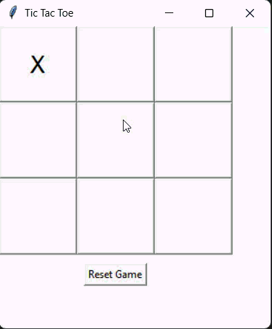

# 🎮 Tic Tac Toe GUI using Python

This project is a Graphical User Interface (GUI) based Tic Tac Toe game developed using Python, NumPy, and Tkinter.
It is a converted version of a console-based game into an interactive window application.

## 🖼️ Demo

## 🎯 Features
* 3×3 interactive game board
* Two-player mode (X vs O)
* Win detection (rows, columns, diagonals)
* Draw detection
* Reset game button
* Clean and simple interface

## 🧠 Game Logic
The game uses a NumPy 2D array to represent the board:
board = np.array([['_','_','_'],['_','_','_'],['_','_','_']])

### Winning conditions:
* Same symbol in any row
* Same symbol in any column
* Same symbol in any diagonal

▶️ How to Run
* Step 1: Install Python
Make sure Python is installed:
python --version
* Step 2: Run the program
python tic_tac_toe_gui.py

## 🛠️ Technologies Used
* Python 3
* NumPy
* Tkinter (GUI library)
